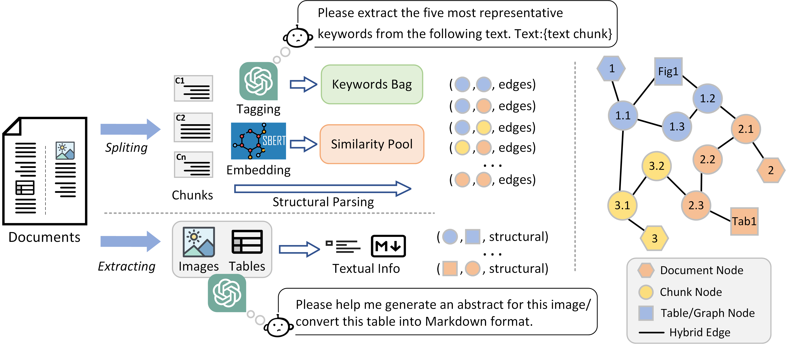

# IIER
This is the code for our paper [Leveraging Inter-Chunk Interactions for Enhanced Retrieval in Large Language Model-Based Question Answering](https://arxiv.org/abs/2408.02907)

## Structure


## Citation
```
@article{guo2024leveraging,
  title={Leveraging Inter-Chunk Interactions for Enhanced Retrieval in Large Language Model-Based Question Answering},
  author={Guo, Tiezheng and Wang, Chen and Liu, Yanyi and Tang, Jiawei and Li, Pan and Xu, Sai and Yang, Qingwen and Gao, Xianlin and Li, Zhi and Wen, Yingyou},
  journal={arXiv preprint arXiv:2408.02907},
  year={2024}
}
```

